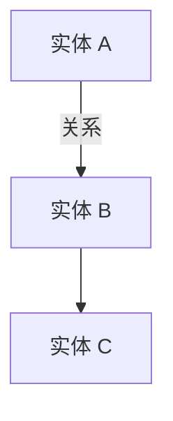

# {{TAG_TITLE}} 导览

> **Reader-level: {{LEVEL}}**。{{LEVEL_HINT}}

## 1. 这个领域 / 模块解决什么(2 分钟版)

<把读者拉进来:用户角色 → 痛点 → 这个领域怎么解 → 1 个最具体的例子>

## 2. 名词扫盲

| 术语 | 一句话 |
|---|---|
| ... | ... |

(beginner 必填;intermediate 可选;expert 跳过)

## 3. 整体架构 / 概念图

(view A / view D 必有;view B 强烈建议;view E 用一张接口表也可)

## 4. 推荐阅读顺序

按这个顺序读,每张卡都能在前一张的基础上理解:

1. **[卡 1 标题](20260101-card-1.md)** — 一句话点题
2. **[卡 2 标题](20260101-card-2.md)** — 一句话点题
   ⚠ 标记最难的那张
3. ...

## 5. 阅读时的"为什么"

带着这些问题读会更聚焦(每张卡 1-2 个,共 4-8 个):

- **Q1 (卡 N)**: ...
- **Q2 (卡 M)**: ...

## 6. 读完之后能干什么

- 具体能做的事 1
- 具体能做的事 2

## 7. 与其他 tag 的关系

- 上游依赖 / 下游使用 / 互补的 tag(若无可写"暂无")
